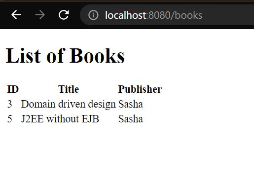

# Spring 5 Web App

_" A simple web app that leverages "_

## Tech Stack

- Java
- Spring Boot
- Spring Data JPA
- Spring MVC
- H2 Database
- Thymeleaf

## Installation

Clone the git repository:

```sourceCode console
$ git clone https://github.com/SASHA-PAIS/spring5webapp.git

$ cd spring5webapp
```

Annotaions such as @Entity, @Id, @GeneratedValue, @ManyToMany, @JoinTable, @OneToMany, @ManyToOne have been used

Data Repositories are created for author, book and publisher which are all interfaces that extend the CrudRepository interface.

Spring Data JPA uses Hibernate to save the author, book and publisher repository content to the in - memory H2 database.

## OUTPUT


## H2 CONSOLE

You can view how the records are stored in the H2 database tables with the help of this console.


## Spring MVC

BookController, a Spring MVC Controller sends the model (that contains the data to be rendered) to the view (Thymeleaf Template).

Thymeleaf is a natural template engine - Natural in the sense that you can view the templates in your browser.


